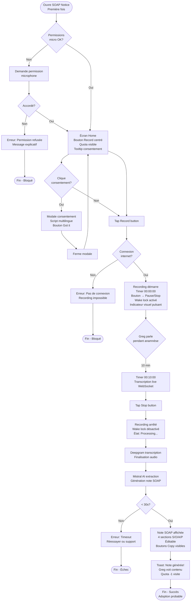
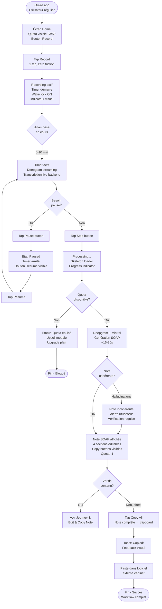
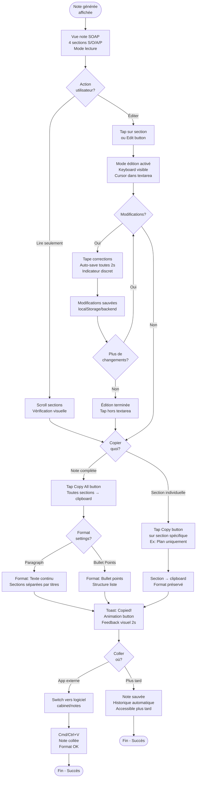
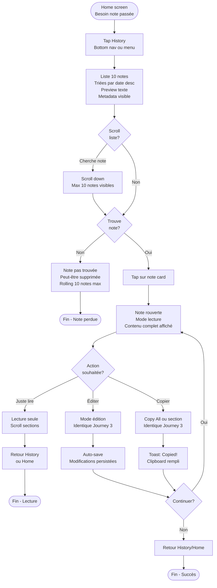
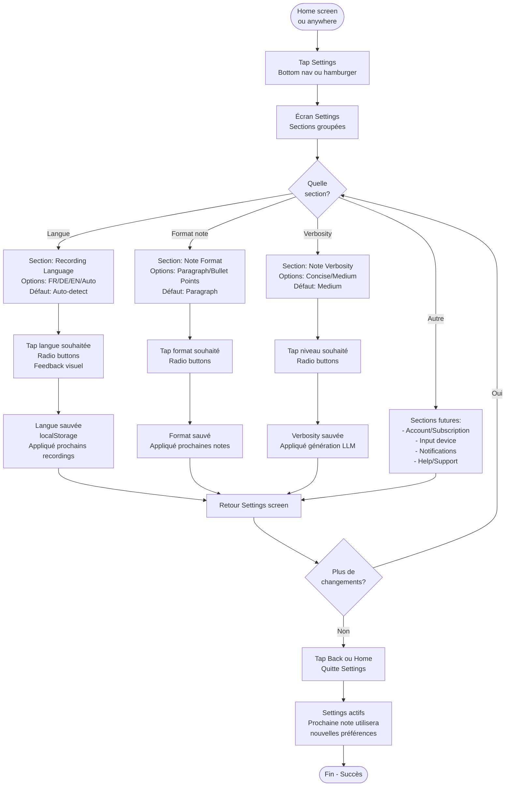

# UX Design Specification SOAP Notice

**Author:** Greg
**Date:** 14 janvier 2026

---

<!-- UX design content will be appended sequentially through collaborative workflow steps -->

## Executive Summary

### Project Vision

SOAP Notice est une application **mobile-first** (smartphone/tablette) conçue pour physiothérapeutes indépendants et cabinets 1-3 praticiens. L'objectif: transformer des enregistrements audio d'anamnèses en notes SOAP structurées en **< 30 secondes**, avec un workflow d'une simplicité radicale.

**Philosophie UX**: Moins c'est plus. Pas de features superflues, pas de complexité. Record → Stop → Copy. C'est tout.

### Target Users

**Persona principal: Greg le Kiné**

- **Contexte**: Kiné indépendant, 7+ nouveaux patients/semaine, perd 5-8 min/note sur documentation manuelle
- **Motivation**: Récupérer ~4h/mois pour se concentrer sur les soins, pas l'admin
- **Tech profil**: Utilisateur smartphone quotidien, sceptique sur l'IA mais pragmatique ("si ça marche, j'adopte")
- **Device**: Smartphone/tablette pendant consultation (patient présent)
- **Environnement**: Cabinet de physiothérapie, environnement parfois bruyant, mains pas toujours libres

**Pain points actuels**:
- Documentation post-consultation prend trop de temps
- Risque d'oubli d'informations importantes
- Frustration de "perdre du temps" sur de l'admin au lieu de soigner

**Job to be done**:
*"Quand je termine une anamnèse, je veux une note SOAP complète et structurée instantanément, pour que je puisse passer au traitement sans perdre 5-8 minutes à écrire."*

### Key Design Challenges

#### Challenge 1: Mobile-First Constraints
**Contexte**: Smartphone/tablette = espace écran limité, navigation touch, keyboard mobile
**Impact UX**: Impossible de reprendre le layout desktop 2-colonnes de Claire. Nécessite architecture navigation mobile native (bottom nav ou hamburger).

#### Challenge 2: Recording Stability Mobile
**Contexte**: Enregistrements jusqu'à 10 min, risque de verrouillage écran ou interruption
**Impact UX**: Besoin de wake lock, indicateurs persistants, gestion erreurs robuste.

#### Challenge 3: Text Editing Mobile
**Contexte**: Note SOAP = 4 sections structurées, édition post-génération obligatoire
**Impact UX**: Interface d'édition mobile optimisée, sections collapsibles, auto-save, keyboard adapté.

#### Challenge 4: Multilingue EU
**Contexte**: FR/DE/EN supportés (+ détection auto), scripts consentement multilingues
**Impact UX**: Sélecteur langue visible, traductions professionnelles, détection automatique intelligente.

### Design Opportunities

#### Opportunity 1: Radical Mobile Simplicity
**Vision**: Créer l'app de transcription clinique **la plus simple** du marché mobile.
**Approche**: Progressive disclosure - workflow core en 2 taps (Record → Stop), settings avancés accessibles mais cachés par défaut.

#### Opportunity 2: Quota Awareness as Feature
**Vision**: Transformer le quota (contrainte business) en feature UX motivante.
**Approche**: Widget "X/50 visites restantes" toujours visible, célébration du gain de temps ("Vous avez économisé 6 min!"), upsell contextuel.

#### Opportunity 3: Mobile-Native Interactions
**Vision**: Exploiter les affordances mobile (haptic, gestures, notifications).
**Approche**: Haptic feedback sur actions critiques, swipe gestures pour navigation historique, notification persistante pendant recording.

#### Opportunity 4: Trust Through Transparency
**Vision**: L'édition post-génération n'est pas un bug, c'est une feature (responsabilité légale).
**Approche**: Encourager explicitement l'édition, montrer les changements utilisateur, ne jamais surfer sur "100% automatique".

## Core User Experience

### Defining Experience

L'expérience centrale de **SOAP Notice** se concentre sur un workflow ultra-linéaire et sans friction:

**Record → Stop → Note SOAP générée → Copy**

**L'action la plus fréquente**: "Enregistrer une nouvelle visite" - Cette action doit être **instantanément accessible** dès l'ouverture de l'application, sans aucune friction préalable.

**L'interaction critique à réussir**:
1. **Recording stable et fiable** - L'enregistrement audio ne doit jamais être interrompu (wake lock, feedback visuel clair, gestion d'erreurs robuste)
2. **Génération de note SOAP sans hallucinations** - La qualité de transcription (Deepgram) et d'extraction structurée (Mistral) doit être irréprochable pour maintenir la confiance utilisateur

L'utilisateur cible (Greg le Kiné) utilise l'application **pendant la consultation** avec le patient présent, sur **smartphone ou tablette**. L'interface n'a pas besoin d'être discrète - l'app est assumée comme outil clinique.

### Platform Strategy

**Type d'application**: Progressive Web App (PWA)
- Accessible depuis Safari, Chrome, Firefox (pas d'installation App Store/Play Store requise)
- Installation optionnelle sur home screen (Add to Home Screen)
- Cross-platform par nature (iOS, Android, desktop si nécessaire)

**Orientations supportées**:
- **Portrait** (prioritaire) - Usage smartphone en main
- **Landscape** (secondaire) - Usage tablette posée sur bureau

**Connectivité requise**:
- **Connexion internet obligatoire** pour la transcription en temps réel (Deepgram WebSocket streaming)
- Pas de mode offline pour le MVP (complexité non justifiée)

**Device capabilities exploitées**:
- ✅ **Wake Lock API** - Empêche le verrouillage automatique de l'écran pendant l'enregistrement (critique pour recordings de 5-10 min)
- ✅ **Web Audio API** - Accès microphone avec sélection input device
- ✅ **Clipboard API** - Copy to clipboard (note complète ou sections individuelles)
- ✅ **Notifications API** - Uniquement pour alertes quota (pas de notification persistante pendant recording)
- ❌ **Haptic feedback** - Pas de vibration tactile, uniquement feedback visuel

**Contraintes techniques**:
- Support minimum: iOS Safari 14+, Chrome 90+, Firefox 88+
- Responsive breakpoints: 320px (mobile) → 768px (tablet) → 1024px+ (desktop fallback)
- Performance: Génération de note < 30 secondes pour 10 min d'audio

### Effortless Interactions

Les interactions suivantes doivent être **ultra-fluides et sans friction**:

#### 1. Start Recording (1 tap)
- Bouton **Record** large, centré, ultra-accessible dès l'ouverture de l'app
- Aucun champ obligatoire avant de démarrer (pas de Patient Name, pas de settings forcés)
- Feedback visuel immédiat: bouton change d'état, timer démarre, indicateur recording visible

#### 2. Copy Flexibility (Pattern Claire)
- **Copy Note complète**: 1 bouton global en bas de la note ("Copy Note" ou "Copy All")
- **Copy sections individuelles**: Chaque section SOAP (Subjective / Objective / Assessment / Plan) a son propre bouton "Copy"
- Format clipboard préservé (markdown ou plaintext selon besoins)
- Feedback visuel après copy: toast "Copied!" ou animation bouton

#### 3. Quota Awareness
- Widget quota **toujours visible** en permanence: "23/50 visites restantes"
- Pas de surprise "quota épuisé" en plein milieu d'une journée de consultations
- Alerte proactive quand < 5 visites restantes

#### 4. Language Switching
- Sélecteur de langue **visible et accessible** (FR / DE / EN / Auto-detect)
- Changement de langue ne nécessite pas de reload app
- Script consentement patient disponible dans toutes les langues

### Critical Success Moments

#### Moment 1: First Recording (Onboarding)
**Contexte**: Première utilisation, utilisateur teste l'app avec scepticisme ("est-ce que ça marche vraiment?")

**Success conditions**:
- Recording démarre en **< 5 secondes** après ouverture de l'app
- Interface claire, aucune confusion sur "quoi faire"
- Feedback visuel immédiat (timer visible, indicateur recording)
- Pas de bugs micro, pas d'erreurs permissions

**Failure risks**: Settings compliqués, confusion UI, bugs accès microphone, interface desktop-thinking sur mobile

---

#### Moment 2: Note Generation (The Magic)
**Contexte**: Recording terminé (Stop pressé), attente de la note SOAP générée

**Success conditions**:
- Note apparaît en **< 30 secondes** (idéalement < 15s)
- Structurée correctement en 4 sections SOAP (Subjective / Objective / Assessment / Plan)
- Contenu pertinent, pas d'hallucinations, transcription précise
- Note immédiatement éditable

**Failure risks**: Timeout, note mal structurée, transcription incohérente, informations inventées (hallucinations LLM), pas d'indicateur de progression

---

#### Moment 3: First Edit (Trust Building)
**Contexte**: Utilisateur ouvre la note générée pour vérifier et corriger

**Success conditions**:
- Interface d'édition **mobile-optimized** (grandes zones touch, keyboard adapté)
- Sections clairement séparées et identifiables (S / O / A / P)
- Auto-save automatique (pas de risque de perte)
- Scroll fluide, sections collapsibles si nécessaire

**Failure risks**: Édition mobile maladroite, keyboard bloque la vue, perte de modifications, interface lente

---

#### Moment 4: Copy to External System
**Contexte**: Utilisateur veut copier la note (complète ou partielle) dans son logiciel de gestion cabinet

**Success conditions**:
- **1 tap** → note copiée dans clipboard → paste direct dans autre app
- Format préservé (markdown ou plaintext propre)
- Option de copier **section individuelle** (ex: uniquement le "P" - Plan) si besoin spécifique

**Failure risks**: Copy partiel, formatage cassé, perte de structure, boutons Copy non visibles

### Experience Principles

Ces principes guident toutes les décisions UX pour **SOAP Notice**:

#### Principe 1: Zero Friction Recording
*"Démarrer un enregistrement ne doit jamais prendre plus de 1 tap. Aucun champ obligatoire, aucun settings préalable, aucune friction. Le bouton Record est roi."*

**Implications**:
- Bouton Record ultra-accessible (center screen, large touch target)
- Settings (Format, Verbosity, Langue) mémorisés et optionnels
- Pas de modale "Entrez le nom du patient" avant recording
- Feedback visuel immédiat au tap (pas de délai de réponse)

---

#### Principe 2: Trust Through Quality
*"La note SOAP générée doit être précise et éditable. On ne promet jamais '100% automatique sans vérification'. On assume et encourage l'édition post-génération comme une feature, pas un bug."*

**Implications**:
- Interface d'édition optimisée et accessible (pas cachée)
- Encouragement explicite à vérifier/éditer la note
- Pas de message marketing du type "Parfait, rien à changer!"
- Transparence sur le processus (Transcription → Extraction → Édition)

---

#### Principe 3: Copy Flexibility
*"L'utilisateur peut copier la note entière OU des sections individuelles (S/O/A/P) selon son besoin du moment. Le format clipboard est propre et préservé."*

**Implications**:
- Bouton "Copy All" global toujours visible
- Chaque section SOAP a son bouton "Copy" individuel
- Format markdown/plaintext propre (pas de HTML brisé)
- Feedback visuel après copy (toast ou animation)

---

#### Principe 4: Mobile-First Stability
*"Le recording doit être rock-solid sur mobile: wake lock actif, feedback visuel clair, gestion d'erreurs robuste, aucune interruption possible."*

**Implications**:
- Wake Lock API activé pendant recording (écran ne verrouille pas)
- Feedback visuel constant (timer, indicateur pulsant, état clairement visible)
- Gestion erreurs: microphone permission, connexion perdue, quota épuisé
- Pas de haptic feedback (vibration) - uniquement visuel

---

#### Principe 5: Progressive Disclosure
*"Le workflow core (Record → Stop → Copy) est immédiatement accessible et compréhensible. Les settings avancés (Format, Verbosity, Langue) sont accessibles mais pas intrusifs."*

**Implications**:
- Écran principal = Record button + Timer + Quota widget
- Settings dans navigation secondaire (hamburger ou bottom nav)
- Defaults intelligents (Format: Paragraph, Verbosity: Medium, Langue: Auto-detect)
- Utilisateur débutant réussit sans toucher aux settings
- Utilisateur avancé peut ajuster selon ses préférences

## Design System Foundation

### Design System Choice

**Choix: Tailwind CSS + shadcn/ui**

SOAP Notice utilisera **Tailwind CSS** comme framework CSS utility-first, complété par **[shadcn/ui](https://ui.shadcn.com/)** pour les composants UI.

shadcn/ui est une collection de composants React réutilisables, accessibles et customisables construits avec:
- **Radix UI** (primitives headless pour accessibilité)
- **Tailwind CSS** (styling utility-first)
- **Copy-paste architecture** (composants dans votre codebase, pas npm dependency)

**Composants clés disponibles:**
- Button, Dialog, Dropdown Menu, Toast
- Form controls (Input, Textarea, Select, Checkbox)
- Navigation (Tabs, Sheet/Drawer)
- Feedback (Alert, Progress, Skeleton)
- Data display (Card, Badge, Separator)

### Rationale for Selection

#### Pourquoi shadcn/ui pour SOAP Notice?

**1. Pas de designer dans l'équipe**
- Composants **pré-stylés professionnels** prêts à l'emploi
- Design cohérent sans compétences design avancées
- Focus développeur sur la logique métier (transcription, LLM) plutôt que sur CSS

**2. Mobile-First PWA Requirements**
- Composants **optimisés responsive** out-of-the-box
- Touch-friendly par défaut
- Patterns d'accessibilité mobile (focus management, keyboard navigation)

**3. Rapidité de développement MVP**
- Copy-paste components = **setup en minutes**
- Pas de learning curve complexe (si vous connaissez React + Tailwind)
- Documentation exhaustive avec exemples

**4. Customisation totale**
- Code dans votre projet = **100% contrôle**
- Pas de "black box" npm package à débugger
- Modification facile pour besoins spécifiques (ex: bouton Record custom)

**5. Accessibilité (A11y) built-in**
- Radix UI garantit **WCAG compliance**
- Gestion clavier/screen readers native
- Important pour outil médical professionnel

**6. Performance**
- Léger (pas de runtime JavaScript lourd)
- Tree-shakeable (seulement ce que vous utilisez)
- Compatible avec Vite (fast HMR)

**7. Écosystème et maintenance**
- Très populaire (communauté active)
- Fréquemment mis à jour
- Nombreux exemples et templates disponibles

### Implementation Approach

#### Setup Initial

```bash
# Installation des dépendances
npx shadcn-ui@latest init
```

Configuration Tailwind existante détectée automatiquement.

#### Architecture de Composants

```
src/
├── components/
│   ├── ui/              # shadcn/ui components (copy-paste)
│   │   ├── button.tsx
│   │   ├── card.tsx
│   │   ├── dialog.tsx
│   │   ├── toast.tsx
│   │   └── ...
│   ├── recording/       # Composants métier SOAP Notice
│   │   ├── RecordButton.tsx
│   │   ├── Timer.tsx
│   │   ├── QuotaWidget.tsx
│   │   └── ...
│   └── soap-note/
│       ├── SOAPEditor.tsx
│       ├── SectionCopy.tsx
│       └── ...
```

**Workflow:**
1. Ajoutez composants shadcn/ui **au besoin** avec `npx shadcn-ui@latest add button`
2. Composants copiés dans `src/components/ui/`
3. Importez et customisez dans vos composants métier

**Composants shadcn/ui prioritaires pour MVP:**
- `button` - Boutons Record/Stop/Pause/Copy
- `card` - Conteneur de note SOAP
- `textarea` - Édition des sections SOAP
- `toast` - Feedback "Copied!" après copy
- `dialog` - Modale consentement patient
- `select` - Sélecteur langue (FR/DE/EN)
- `badge` - Quota widget ("23/50 visites")
- `skeleton` - Loading state pendant génération note

### Customization Strategy

#### 1. Design Tokens (Tailwind Config)

**Palette couleurs adaptée au médical:**
- **Primary**: Vert professionnel (confiance, santé) - à définir step 8
- **Neutral/Gray**: Pour texte et backgrounds
- **Success**: Feedback positif (note générée)
- **Warning**: Alertes quota (< 5 visites)
- **Error**: États d'erreur (connexion perdue, timeout)

**Typography:**
- Font lisible mobile (système -apple-system, Roboto, ou Inter)
- Sizes responsive (base 16px mobile, scale fluide)

**Spacing & Sizing:**
- Touch targets: minimum 44x44px (iOS guidelines)
- Padding généreux pour mobile
- Breakpoints: `sm: 640px` (phone landscape), `md: 768px` (tablet)

#### 2. Composants Customisés

**RecordButton (Ultra Custom):**
- Basé sur shadcn `<Button>` mais avec:
  - **États visuels clairs**: Idle / Recording (pulse animation) / Paused / Stopped
  - **Large touch target** (80x80px minimum)
  - **Icon + Label** (microphone icon)
  - **Feedback visuel fort** (border glow pendant recording)

**SOAPEditor (Custom Composition):**
- Basé sur shadcn `<Card>` + `<Textarea>`
- **4 sections éditables** (S / O / A / P)
- **Copy button** par section (shadcn `<Button>` variant)
- **Auto-save** indicator discret
- **Sections collapsibles** (optionnel, si note longue)

**QuotaWidget:**
- Basé sur shadcn `<Badge>`
- **Always visible** (sticky header ou floating)
- **Color-coded**: Green (> 10 visites) / Orange (5-10) / Red (< 5)

**LanguageSelector:**
- Basé sur shadcn `<Select>`
- **Flags icons** (FR 🇫🇷 / DE 🇩🇪 / EN 🇬🇧 / Auto 🌐)
- Accessible via Settings

#### 3. Responsive Patterns

**Mobile-First Approach:**
- Design pour 320px (iPhone SE) d'abord
- Progressive enhancement pour tablet/desktop
- **Portrait prioritaire**, landscape secondaire

**Layout Strategy:**
- **Mobile**: Single column, bottom navigation
- **Tablet**: Possibilité 2 colonnes pour édition note (portrait = 1 col)

#### 4. Accessibilité Enhancements

shadcn/ui garantit accessibilité de base (Radix UI), mais ajouts SOAP Notice:

- **Focus visible** clair (outlines Tailwind ring)
- **Skip links** ("Skip to note", "Skip to history")
- **ARIA labels** explicites sur boutons icon-only
- **Screen reader announcements** pour changements d'état (recording started, note generated)
- **Keyboard shortcuts** (optionnel): Space = Record/Stop, Cmd/Ctrl+C = Copy

#### 5. Theming & Brand

**Pas de branding complexe pour MVP:**
- Palette simple et professionnelle (vert médical + neutrals)
- Logo simple (texte "SOAP Notice" suffisant pour MVP)
- Focus sur **clarté et efficacité** plutôt que sur branding fancy

**Dark mode?**
- **Pas pour MVP** (ajout post-launch si demandé)
- shadcn/ui supporte dark mode nativement si besoin futur

## User Journey Flows

### Journey 1: First Time Recording (Onboarding)

**Contexte**: Greg ouvre SOAP Notice pour la première fois, sceptique mais prêt à tester.

**Objectif**: Réussir le premier enregistrement sans friction, comprendre l'interface, voir une note SOAP générée.

**Success criteria**:
- Recording démarre en < 5 secondes
- Interface claire, pas de confusion
- Note générée en < 30s
- Greg pense "ça marche vraiment!"



---

### Journey 2: Regular Recording Workflow (Core)

**Contexte**: Utilisateur habituel (a déjà fait 5-10 recordings), utilise l'app quotidiennement.

**Objectif**: Workflow ultra-rapide: Record → Stop → Copy en < 2 min total.

**Success criteria**:
- Démarrage en 1 tap
- Aucune friction
- Note précise sans hallucinations
- Copy réussie vers logiciel externe



---

### Journey 3: Edit & Copy Note

**Contexte**: Note SOAP générée, utilisateur veut vérifier/corriger avant de copier.

**Objectif**: Éditer rapidement les sections nécessaires, copier (complète ou partielle).

**Success criteria**:
- Édition mobile fluide
- Auto-save transparent
- Copy flexible (complète ou par section)
- Pas de perte de modifications



---

### Journey 4: Access Note from History

**Contexte**: Utilisateur veut retrouver une note passée (d'hier, semaine dernière).

**Objectif**: Naviguer historique → Retrouver note → Rouvrir → Éditer/Copier.

**Success criteria**:
- Historique accessible en 1-2 taps
- Notes identifiables (date, patient, preview)
- Réouverture instantanée
- Édition/copy identique à note fraîche



---

### Journey 5: Settings Configuration

**Contexte**: Utilisateur veut ajuster préférences (langue, format note, verbosity).

**Objectif**: Modifier settings → Sauvegarder → Appliquer aux prochaines notes.

**Success criteria**:
- Settings accessibles facilement
- Changements clairs et immédiats
- Pas de reload app nécessaire
- Defaults intelligents mémorisés



---

### Journey Patterns

Après analyse des 5 parcours, voici les **patterns communs** à standardiser:

#### Navigation Patterns

**Pattern 1: Bottom Navigation (Mobile)**
- **Usage**: Navigation principale Home / History / Settings
- **Pourquoi**: Thumb-friendly mobile, toujours accessible
- **Implémentation**: Bottom nav bar fixe, 3 items max

**Pattern 2: Modal/Sheet Overlay**
- **Usage**: Consentement patient, erreurs bloquantes, upsell quota
- **Pourquoi**: Capte attention sans navigation destructive
- **Implémentation**: shadcn `<Dialog>` ou `<Sheet>` (drawer mobile)

**Pattern 3: Back Navigation**
- **Usage**: Retour depuis note detail, historique, settings
- **Pourquoi**: Convention mobile, predictable
- **Implémentation**: Header back arrow ou swipe gesture

#### Feedback Patterns

**Pattern 1: Toast Notifications**
- **Usage**: Copy success, auto-save confirmations, non-blocking info
- **Pourquoi**: Feedback immédiat sans bloquer workflow
- **Implémentation**: shadcn `<Toast>` en top-right (mobile) ou bottom-center

**Pattern 2: Inline Error Messages**
- **Usage**: Erreurs permissions, connexion, quota épuisé
- **Pourquoi**: Contexte clair, actionnable
- **Implémentation**: Alert banner sous action concernée

**Pattern 3: Loading States**
- **Usage**: Processing note (15-30s), transcription en cours
- **Pourquoi**: Manage expectations, reduce anxiety
- **Implémentation**: Skeleton loaders (shadcn `<Skeleton>`), progress spinners

#### State Management Patterns

**Pattern 1: Persistent State (localStorage)**
- **Usage**: Settings (langue, format, verbosity), historique 10 notes
- **Pourquoi**: Pas de backend complexe pour MVP, rapide
- **Implémentation**: React hooks + localStorage sync

**Pattern 2: Optimistic UI**
- **Usage**: Auto-save édition, copy to clipboard
- **Pourquoi**: Feels instant, améliore perception perf
- **Implémentation**: Update UI immédiatement, sync async

**Pattern 3: Error Recovery**
- **Usage**: Timeout transcription, connexion perdue pendant recording
- **Pourquoi**: Ne jamais perdre travail utilisateur
- **Implémentation**: Retry automatique (3x), puis message actionnable

---

### Flow Optimization Principles

#### 1. Minimize Friction to Value
- **Recording démarre en 1 tap** (pas de champs obligatoires)
- **Copy en 1 tap** (bouton visible, action immédiate)
- **Settings optionnels** (defaults intelligents, workflow fonctionne sans y toucher)

#### 2. Progressive Disclosure
- **Home screen = essentials uniquement** (Record button, quota, timer)
- **Settings cachés** (bottom nav secondaire)
- **Advanced features post-MVP** (favoris, tags, search) si besoin

#### 3. Clear Feedback Loops
- **États visuels évidents**: Idle / Recording / Processing / Ready
- **Timer toujours visible** pendant recording (anxiety reduction)
- **Progress indicators** pendant génération note (15-30s feels shorter)

#### 4. Error Prevention > Error Handling
- **Check connexion avant recording** (évite frustration après 10 min)
- **Wake lock automatique** (évite interruption screen lock)
- **Auto-save édition** (évite perte modifications)

#### 5. Mobile-First Optimizations
- **Touch targets larges** (min 44x44px boutons critiques)
- **Thumb zone priority** (Record button center-bottom, facile pouce)
- **Keyboard-aware** (édition note, textarea scroll visible au-dessus keyboard)

## Component Strategy

### shadcn/ui Components (Foundation)

Composants utilisés **directement** depuis shadcn/ui:

| Composant | Usage dans SOAP Notice |
|-----------|------------------------|
| `Button` | Actions principales, Copy buttons |
| `Card` | Conteneur note SOAP, note history cards |
| `Textarea` | Édition sections SOAP |
| `Dialog` | Modale consentement, erreurs, upsell |
| `Sheet` | Drawer mobile pour menus |
| `Toast` | Feedback copy success, auto-save |
| `Select` | Sélecteur langue |
| `Badge` | Tags, labels |
| `Skeleton` | Loading states |
| `Separator` | Divisions visuelles |

### Custom Components (À Créer)

Composants **spécifiques** à SOAP Notice (basés sur shadcn/ui):

#### 1. RecordButton
- **Purpose**: Démarrer/Pause/Stop l'enregistrement audio
- **States**: `idle` | `recording` | `paused` | `processing`
- **Size**: Large (80x80px min), touch-optimized
- **Visual**: Pulse animation pendant recording, icon microphone

#### 2. Timer
- **Purpose**: Afficher durée enregistrement en cours
- **Format**: `HH:MM:SS`
- **States**: `running` | `paused` | `stopped`
- **Size**: Grande typographie, lisible à distance

#### 3. QuotaWidget
- **Purpose**: Afficher visites restantes en permanence
- **Format**: `"23/50 visites restantes"`
- **States**: `normal` (vert) | `warning` (orange, < 10) | `critical` (rouge, < 5) | `empty` (quota épuisé)
- **Position**: Header sticky ou floating

#### 4. SOAPEditor
- **Purpose**: Afficher/Éditer les 4 sections de la note SOAP
- **Sections**: Subjective | Objective | Assessment | Plan
- **Features**:
  - Chaque section éditable (textarea)
  - Bouton Copy individuel par section
  - Auto-save avec indicateur discret
  - Mode lecture vs édition

#### 5. SectionCopyButton
- **Purpose**: Copier une section individuelle vers clipboard
- **States**: `idle` | `copied` (feedback 2s)
- **Feedback**: Toast + animation bouton

#### 6. CopyAllButton
- **Purpose**: Copier note SOAP complète
- **States**: `idle` | `copied`
- **Position**: Bottom de la note, toujours visible

#### 7. NoteHistoryCard
- **Purpose**: Afficher une note dans la liste historique
- **Content**: Date, preview texte (truncated), metadata
- **Actions**: Tap → ouvre note complète

#### 8. ConsentDialog
- **Purpose**: Afficher script consentement patient
- **Content**: Texte multilingue (FR/DE/EN), illustration
- **Actions**: Bouton "Got it!" pour fermer

#### 9. LanguageSelector
- **Purpose**: Choisir langue d'enregistrement
- **Options**: FR 🇫🇷 | DE 🇩🇪 | EN 🇬🇧 | Auto 🌐
- **Persistence**: localStorage

#### 10. BottomNav
- **Purpose**: Navigation principale mobile
- **Items**: Home (Record) | History | Settings
- **Style**: Fixe en bas, 3 items max
