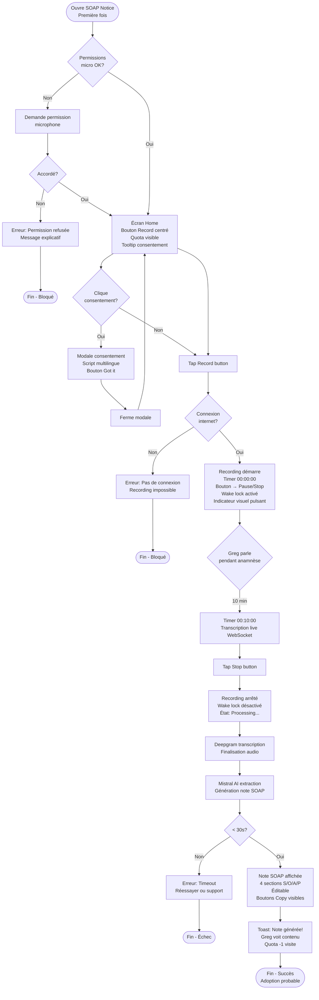
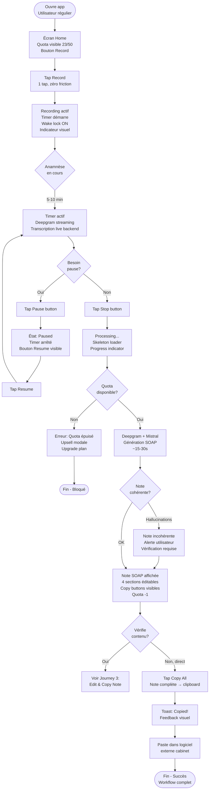
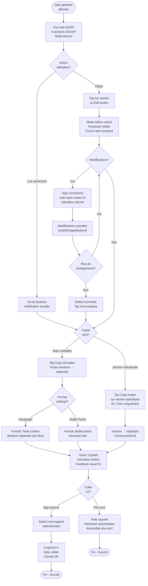
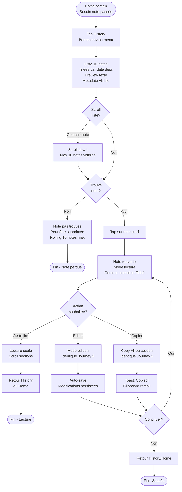
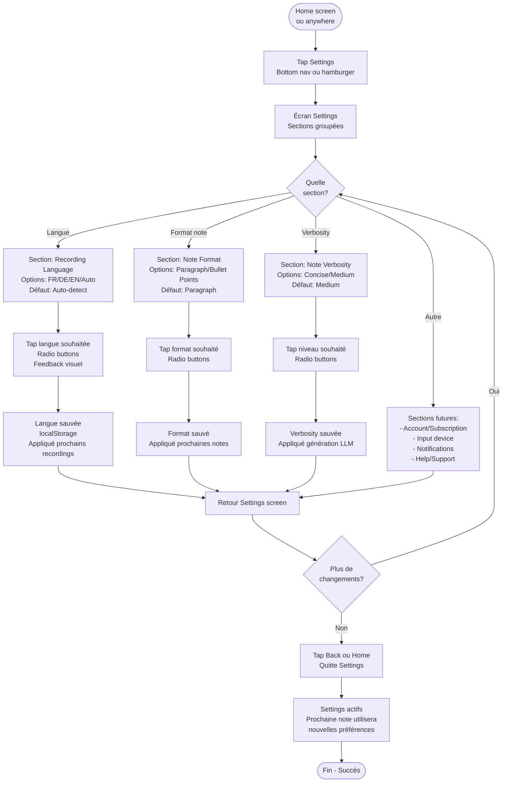

# User Journey Flows

## Journey 1: First Time Recording (Onboarding)

**Contexte**: Greg ouvre SOAP Notice pour la première fois, sceptique mais prêt à tester.

**Objectif**: Réussir le premier enregistrement sans friction, comprendre l'interface, voir une note SOAP générée.

**Success criteria**:
- Recording démarre en < 5 secondes
- Interface claire, pas de confusion
- Note générée en < 30s
- Greg pense "ça marche vraiment!"

---

## Journey 2: Regular Recording Workflow (Core)

**Contexte**: Utilisateur habituel (a déjà fait 5-10 recordings), utilise l'app quotidiennement.

**Objectif**: Workflow ultra-rapide: Record → Stop → Copy en < 2 min total.

**Success criteria**:
- Démarrage en 1 tap
- Aucune friction
- Note précise sans hallucinations
- Copy réussie vers logiciel externe

---

## Journey 3: Edit & Copy Note

**Contexte**: Note SOAP générée, utilisateur veut vérifier/corriger avant de copier.

**Objectif**: Éditer rapidement les sections nécessaires, copier (complète ou partielle).

**Success criteria**:
- Édition mobile fluide
- Auto-save transparent
- Copy flexible (complète ou par section)
- Pas de perte de modifications

---

## Journey 4: Access Note from History

**Contexte**: Utilisateur veut retrouver une note passée (d'hier, semaine dernière).

**Objectif**: Naviguer historique → Retrouver note → Rouvrir → Éditer/Copier.

**Success criteria**:
- Historique accessible en 1-2 taps
- Notes identifiables (date, patient, preview)
- Réouverture instantanée
- Édition/copy identique à note fraîche

---

## Journey 5: Settings Configuration

**Contexte**: Utilisateur veut ajuster préférences (langue, format note, verbosity).

**Objectif**: Modifier settings → Sauvegarder → Appliquer aux prochaines notes.

**Success criteria**:
- Settings accessibles facilement
- Changements clairs et immédiats
- Pas de reload app nécessaire
- Defaults intelligents mémorisés

---

## Journey Patterns

Après analyse des 5 parcours, voici les **patterns communs** à standardiser:

### Navigation Patterns

**Pattern 1: Bottom Navigation (Mobile)**
- **Usage**: Navigation principale Home / History / Settings
- **Pourquoi**: Thumb-friendly mobile, toujours accessible
- **Implémentation**: Bottom nav bar fixe, 3 items max

**Pattern 2: Modal/Sheet Overlay**
- **Usage**: Consentement patient, erreurs bloquantes, upsell quota
- **Pourquoi**: Capte attention sans navigation destructive
- **Implémentation**: shadcn `<Dialog>` ou `<Sheet>` (drawer mobile)

**Pattern 3: Back Navigation**
- **Usage**: Retour depuis note detail, historique, settings
- **Pourquoi**: Convention mobile, predictable
- **Implémentation**: Header back arrow ou swipe gesture

### Feedback Patterns

**Pattern 1: Toast Notifications**
- **Usage**: Copy success, auto-save confirmations, non-blocking info
- **Pourquoi**: Feedback immédiat sans bloquer workflow
- **Implémentation**: shadcn `<Toast>` en top-right (mobile) ou bottom-center

**Pattern 2: Inline Error Messages**
- **Usage**: Erreurs permissions, connexion, quota épuisé
- **Pourquoi**: Contexte clair, actionnable
- **Implémentation**: Alert banner sous action concernée

**Pattern 3: Loading States**
- **Usage**: Processing note (15-30s), transcription en cours
- **Pourquoi**: Manage expectations, reduce anxiety
- **Implémentation**: Skeleton loaders (shadcn `<Skeleton>`), progress spinners

### State Management Patterns

**Pattern 1: Persistent State (localStorage)**
- **Usage**: Settings (langue, format, verbosity), historique 10 notes
- **Pourquoi**: Pas de backend complexe pour MVP, rapide
- **Implémentation**: React hooks + localStorage sync

**Pattern 2: Optimistic UI**
- **Usage**: Auto-save édition, copy to clipboard
- **Pourquoi**: Feels instant, améliore perception perf
- **Implémentation**: Update UI immédiatement, sync async

**Pattern 3: Error Recovery**
- **Usage**: Timeout transcription, connexion perdue pendant recording
- **Pourquoi**: Ne jamais perdre travail utilisateur
- **Implémentation**: Retry automatique (3x), puis message actionnable

---

## Flow Optimization Principles

### 1. Minimize Friction to Value
- **Recording démarre en 1 tap** (pas de champs obligatoires)
- **Copy en 1 tap** (bouton visible, action immédiate)
- **Settings optionnels** (defaults intelligents, workflow fonctionne sans y toucher)

### 2. Progressive Disclosure
- **Home screen = essentials uniquement** (Record button, quota, timer)
- **Settings cachés** (bottom nav secondaire)
- **Advanced features post-MVP** (favoris, tags, search) si besoin

### 3. Clear Feedback Loops
- **États visuels évidents**: Idle / Recording / Processing / Ready
- **Timer toujours visible** pendant recording (anxiety reduction)
- **Progress indicators** pendant génération note (15-30s feels shorter)

### 4. Error Prevention > Error Handling
- **Check connexion avant recording** (évite frustration après 10 min)
- **Wake lock automatique** (évite interruption screen lock)
- **Auto-save édition** (évite perte modifications)

### 5. Mobile-First Optimizations
- **Touch targets larges** (min 44x44px boutons critiques)
- **Thumb zone priority** (Record button center-bottom, facile pouce)
- **Keyboard-aware** (édition note, textarea scroll visible au-dessus keyboard)
